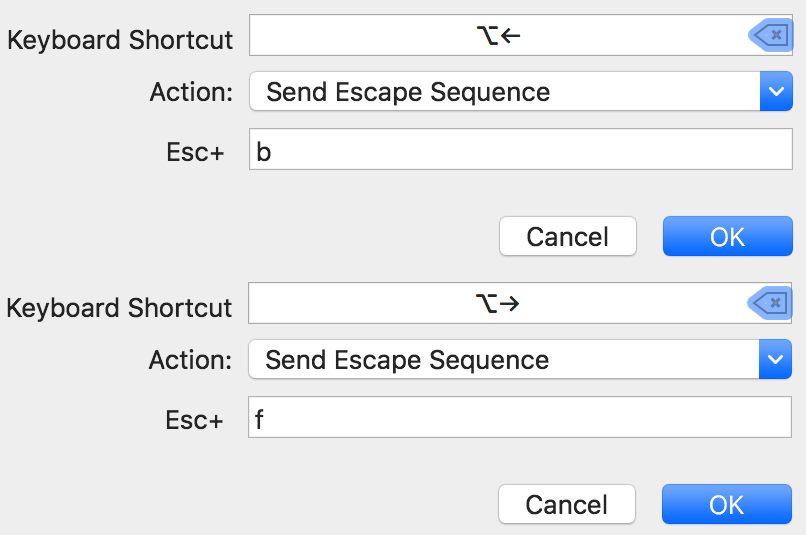

My team at work has grown a lot lately. Developers who joined the team are
as experienced or more than I am. So when we started working together, the
things I felt confident enough to help them with was our existing codebases
and tools. After some pair programming with one of my colleagues, I thought
I could show him a tip or two regarding what I use daily which makes my life
easier as a developper.

## Task management

I’ve been using [Things 3](https://culturedcode.com/things/) on a daily
basis for more than a year now. I was used to simple text notes, whether
virtual or physical (I love those colourful post-its) and I’ve never been
searching for something more complicated. The way Things and its interface
are designed made me stick to it entirely after a few weeks. Its apparent
simplicity hides a lot of details that make it an efficient product.

However, the most important feature is that I forget about it. Things is
simply a tool. I need it to be fast, I need it to be simple. If you’re
looking for a tool to keep track of your work, pick the one that is the
closest to your workflow and which doesn’t get in your way every time you
need to think about something. Whether you’d prefer having tags and projects,
directories, sub-tasks etc. doesn’t really matter. Are you able to write down
your ideas and TODOs at _your_ speed of thought? This is what really matters.

## Vim

Learning Vim is a bit steep to be honest. I’m not advocating for a specific
editor/IDE and especially not for this one, but learning the basics of Vim can
help you on a daily basis. I was using Vim as my main editor for approximately
6 years before moving almost entirely to IntelliJ IDEA. However, I’m still
using Vim or its moves daily. Be it for commit messages, quickly check log
files, edit configurations, web browser navigation [^1], etc. Every time you
are dropped on a new server, a presentation’s laptop or a coworker’s,
you have it pre-installed 99% of the time. It can be used out-of-the-box
and it is blazing fast to start up and to work with.

I guess the best selling point of Vim as a daily editor or “side-editor”
is that you can quickly edit and move with memorisable commands. Keeping
the right arrow key pressed to move the cursor three words to the right, to
finally remove the fourth word — again, with backspace key pressed — and
then type your correction is a bit long. Remember when grandpa is clicking
repeatedly on the bottom of the right scrollbar of his web browser until
the page goes down… You’d really love him to use the scrollbar as you
told him hundred times before (but it’s ok because we can spend more time
together anyway). Well, I feel a bit the same when I see someone using Vim
this way. But you’re not my grandpa. And we should be both doing something
else rather than editing this file and waiting in silence for this cursor to
move. Typing `3wcw` is all you need in Vim to make you replace the fourth word
on your line. Agree that it’s ugly but it’s also quite fast. Literally,
it means:

- `3w` move by words forward (`3 words`)
- `cw` delete the current word until its end and put me in insert mode (`change word`)

Long story short, just spend an hour playing with `vimtutor` which should
be installed on your machine along with `vim` itself. It is a complete
tutorial covering the basics. In my opinion, everything until lesson 4.3
(`Matching Parentheses Search` at the time I’m writing) is a must-read. The
other half of the tutorial contains both must-read sections and less-useful
features. Up to you then. And use it daily. Every time you edit a small
file or want to see the content of one, use `vim`. Configure your shell’s
`EDITOR` environment variable to `vim`. This way, Vim will pop up by itself
most of the time (when editing commit messages for instance). Practicing is
key but it may take some time before it clicks.

## Vimium

Once you get confortable with Vim
moves, you should take a look at `Vimium` (both
[Chrome](https://chrome.google.com/webstore/detail/vimium/dbepggeogbaibhgnhhndojpepiihcmeb?hl=en)
and [Firefox](https://addons.mozilla.org/en-US/firefox/addon/vimium-ff/)
versions are available). It lets you move within and between pages in your
web browser. It’s the fastest way I know to browse from my keyboard. I
know there are more configurable alternatives out there. However, I enjoy
Vimium simplicity and stability.

## iTerm2

`Terminal` application on macOS is an ok default terminal application. I find
it a bit ugly and hard to configure. A good alternative most of the people
use today is [iTerm2](https://www.iterm2.com/). I cannot tell you about all
the ways to configure it (there are plenty) but I just wanted to share with
you a few things I’m missing on someone else’s computer when using it.

Move one word left/right is doable solely using combinations of `Alt+B`/`Alt+F`
keys but I never get used to it. So I’m still stuck with `Alt+Left
arrow`/`Alt+Right arrow`. To enabled it in `iTerm2`, go to `Preferences >
Profiles tab > Keys tab` and in the `Key Mappings` list, add or change the
following mappings:

## Spectacle

Probably one my mostly used application — which also makes me
really uncomfortable when using someone else’s computer — is
[Spectacle](https://www.spectacleapp.com/). This small and stable application
lets you quickly move your windows on your screen but also across many
displays. It has been the perfect app for me [^2] as it doesn’t involve
a lot of learning and the default keys are mostly sane and not conflicting
so much with other applications’ keybindings.

## Alfred & Dash

Last but not least, and by far the software I would miss the most if
it was to disappear: the [Alfred](https://www.alfredapp.com/) launcher
application. I cannot tell about all the things Alfred can do for you,
considering how extensible it is. I’m not a power user but I’m using
it for everything: launching apps, [converting words between French and
English](http://www.packal.org/workflow/linguee-en-fr) (with context),
[checking color codes](http://www.packal.org/workflow/colors)
and more importantly, [to trigger Dash
queries](https://github.com/Kapeli/Dash-Alfred-Workflow).

[Dash](https://kapeli.com/dash) is application that centralise all your
documentations and lets you search through it at the speed of thoughts. It
works on many languages _and_ technologies. By the way, it works fully offline.

## macOS

Nearly forgot to talk about macOS itself. If I remember correctly, there
are three hidden features on macOS that do not come out of the box. As a
used them virtually everyday, I thought it was worth sharing:

1. Tap to click under `System Preferences > Trackpad > Point & Click tab > Tap to click checkbox`
2. Three fingers drap & drop under `System Preferences > Accessibility > Mouse & Trackpad > Trackpad Options... button > Enable dragging checkbox with "three finger drap"`
3. Control + Scroll to zoom in/out on the screen under `System Preferences > Accessibility > Zoom > Use scroll gesture with modifier keys to zoom checkbox with "^ Control"`

I was always wondering if the path down to these options was a joke or some
kind of contest for power users from Apple [^3].

Apparently, there’s no contest.

[^1]: I used Vimium when I was still on Chrome, nowadays I’m using Vimium-FF
on Firefox. I know there are more configurable alternatives such as tridactyl
but I’m fine with the simple solution.

[^2]: I totally miss i3 from the time my primary operating system was Linux
based :’(

[^3]: IIRC the three fingers drag & drop was enabled by default on older
versions of macOS.

