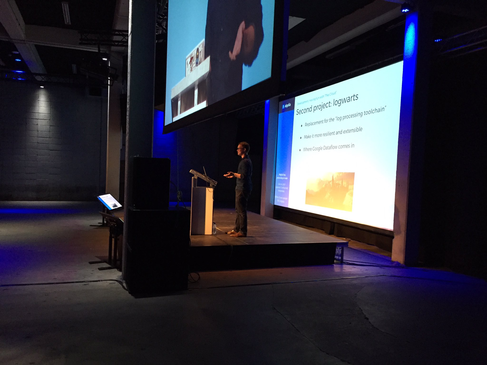
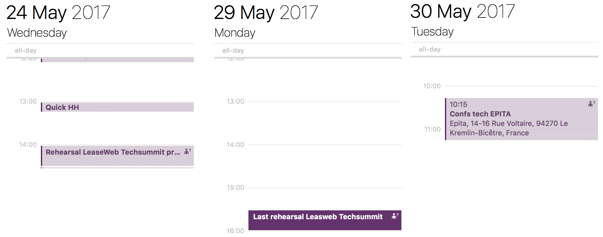

# Talking at a Tech Conference

Developer is not always a speaking job. Of course, you discuss with your
colleagues, about what they are working on, how they are doing, you have
meetings and discussions regarding your projects. But as a developer, you are
rarely speaking with customers, direct users. This is even more true when
you are working on infrastructure or on the backend.

## From Paris classrooms to Amsterdam TechSummit

When I've joined Algolia in January 2016, I was happy to see how open the
company was regarding public speaking. At that time, the company was still
small (I was the 36\<sup\>th\</sup\> employee) and, as in any other startup,
word-of-mouth was really important. All employees were more than welcome to
talk at meetups, conferences, etc. And this is still true today. The marketing
team has grown a lot in the last year, and as new employees are joining, they
are making sure that everyone in the company who's keen to speak at conferences
or meetups will be able to do it. No matter if you're the VP of something,
solution engineer, frontend or backend developer, accountant or office
manager. If you come and say "hey guys, I know this conference, I think it will
be good to have Algolia there for these reasons and I'd be happy to talk there"
they are here to help.

From 2013 to 2015, I was still a student. I was also teaching at my school to
2\<sup\>nd\</sup\>, 4\<sup\>th\</sup\> and 5\<sup\>th\</sup\> CS students. It taught me a
lot regarding public speaking and teamwork, as I was working with around 30
schoolmates, few academic teachers and the school administration itself. I was
also used to do presentation to academic researchers in the laboratory when I
was part-time working. Then, I've did some talks regarding how we used to
handle support at Algolia (we haven't any QA team as of today) and the
challenges to maintain the Algolia Go API client. All of these were great
experiences, I was speaking English or French in front of a tens of people
(actually more than 100 students at my school) about both technical and
non-technical subjects for various audiences.

So after nearly one year of work on the new log processing toolchain the
occasion showed up to speak at an internal conference, I cannot say I was
ready for it but at least to give it a try. And as my colleagues were really
supportive, I accepted.

## Preparing the talk

The very first step when you want to speak at a conference is to submit your
talk with a title, an abstract, sometimes a few words about yourself and also
why you think the talk fits the conference purpose. This process is the Call
For Papers or CFP, sometimes named Call For Speakers. Then you wait for an
answer. Actually you may even wait for nothing at some conferences are not even
telling you your talk wasn't selected. However, if everything goes well, you
will finally receive this kind of email:

> Thank you for sending in a proposal to speak at TechSummit Amsterdam
> (techsummit.io)!
>
> The Program committee has reviewed all the proposals and we are happy to
> include your talk “Building a magic and reliable pipeline in the cloud” in
> the schedule.

Needless to say, I was both highly happy and surprise to read it. But then, the
actual work begins.

This was the easiest (not the easy ;) ) part for me: writing the talk. I've
actually prepared quite a lot of presentations in the past and I like spending
time on it, building a story, making the slides and the schemas. Once the first
draft is done, it's time to rehearse.

*Scheduling the rehearsals*

I did few rehearsals alone and two with my colleagues (thank you again for your
time guys). It is really important to do it in front of people to let them tell
you what is actually wrong in your presentation, whether it's what you say, how
you say it or how you present it. Also, you cannot notice your own verbal tics.
Most of those issues can be addressed when you try your presentation against an
actual audience. Finally, after those multiple sessions and fixes, I had the
opportunity to try this talk in front of CS students from my previous school,
in French this time. All went great, but the day after, I was leaving with my
teammates for Amsterdam.

## Speaker dinner and going to the venue

Some conferences organize what they call the "speaker dinner" a day before the
event. It helps the speakers to meet altogether around a nice meal in a more
informal way. This time, it was at the [TonTon Club West](https://tontonclub.nl/).
I met speakers from LeaseWeb, Docker, Elastic for instance and had nice
discussions regarding challenges they were tackling. After a nice meal (noodle
burger, yes, it does exist and it's good), we played some games together and
even tried some dance steps on Dance Dance Revolution machines!

After a small breakfast, I arrived to the venue with few Algolia colleagues to
install our booth and prepare the goodies. As everything was well-organized by
Leaseweb, I just had to be on stage 10 minutes before the beginning of my talk
to put on and try the microphone and *enjoy* as one of the organizers told me.
Overall, I was very happy to be there and I really thankful to Algolia for this
opportunity. Last thing now is to re-watch my talk and improve on all the
things that I'm doing wrong... Nearly one month later, I still haven't watch
it. I know, I know, I'll have to do it... Eventually, it's painful. I'll
[drop it here](https://www.youtube.com/watch?v=Y7qypy633dw) just in case.

